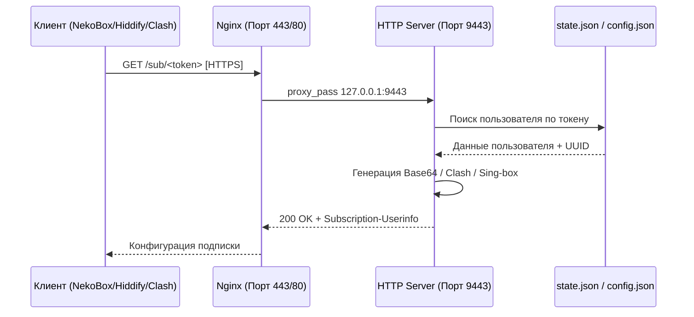
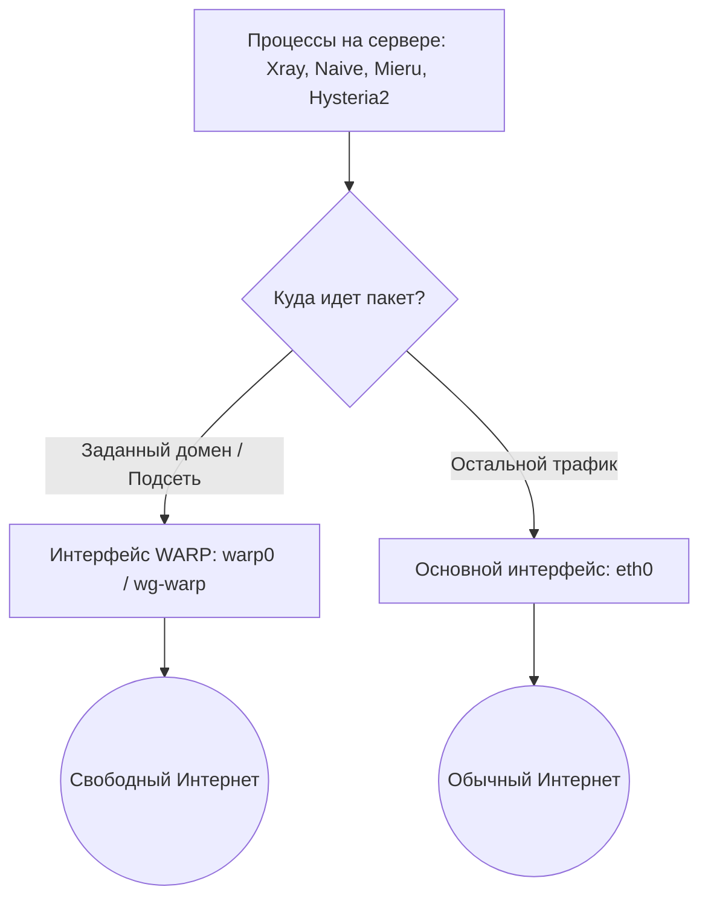

# 👑 VLESS Ultimate Installer: Fork Edition (by gr33nimax)

[](https://github.com/gr33nimax/VLESS-Ultimate-Installer)
[](https://python.org)
[](file:///C:/Users/user/.gemini/antigravity/scratch/vless-ultimate-fork/LICENSE)
[](https://ubuntu.com)
[](https://telegram.org)

Премиальный скрипт для автоматического развертывания безопасных, высокоскоростных и устойчивых к блокировкам прокси-серверов. Данный форк значительно расширяет оригинальный инсталлятор за счет добавления **полноценной системы подписок пользователей** (совместимой с NekoBox, Clash Meta, Hiddify) и **универсального WARP-обхода на уровне операционной системы (ip route)**.

```text
 ██╗   ██╗██╗     ███████╗███████╗███████╗  ██╗   ██╗██╗  ████████╗██╗███╗   ███╗ █████╗ ████████╗███████╗
 ██║   ██║██║     ██╔════╝██╔════╝██╔════╝  ██║   ██║██║  ╚══██╔══╝██║████╗ ████║██╔══██╗╚══██╔══╝██╔════╝
 ██║   ██║██║     █████╗  ███████╗███████╗  ██║   ██║██║     ██║   ██║██╔████╔██║███████║   ██║   █████╗  
 ╚██╗ ██╔╝██║     ██╔══╝  ╚════██║╚════██║  ██║   ██║██║     ██║   ██║██║╚██╔╝██║██╔══██║   ██║   ██╔══╝  
  ╚████╔╝ ███████╗███████╗███████║███████║  ╚██████╔╝███████╗██║   ██║██║ ╚═╝ ██║██║  ██║   ██║   ███████╗
   ╚═══╝  ╚══════╝╚══════╝╚══════╝╚══════╝   ╚═════╝ ╚══════╝╚═╝   ╚═╝╚═╝     ╚═╝╚═╝  ╚═╝   ╚═╝   ╚══════╝
                            ⚡ Ultimate Fork by gr33nimax ⚡
```

---

## 📖 Содержание
1. [Архитектура и Новые Функции](#-архитектура-и-новые-функции)
   - [Встроенная Система Подписок](#1-встроенная-система-подписок)
   - [Универсальный WARP-обход на уровне ОС](#2-универсальный-warp-обход-на-уровне-ос)
   - [Telegram-бот Команды](#3-telegram-бот-команды)
2. [🚀 Быстрый запуск](#-быстрый-запуск)
3. [🔧 Ручная установка](#-ручная-установка)
4. [🔄 Обновление и миграция](#-обновление-и-миграция)
5. [⚙️ CLI-флаги форка](#-cli-флаги-форка)
6. [📂 Структура проекта](#-структура-проекта)
7. [💻 Настройка клиентов](#-настройка-клиентов)
8. [❓ Решение проблем (Troubleshooting)](#-решение-проблем-troubleshooting)
9. [🛡️ Лицензия и безопасность](#-лицензия-и-безопасность)

---

## 🏗️ Архитектура и Новые Функции

### 1. Встроенная Система Подписок
Оригинальный скрипт выдавал статические ссылки при создании пользователей. Наш форк развертывает динамический сервер подписок, который автоматически генерирует актуальные конфигурации во всех популярных форматах:

* **Base64 (Standard)** — для Hiddify, v2rayNG, Shadowrocket, Streisand.
* **Clash Meta (Mihomo) YAML** — для Clash Verge, Nyanpasu, Mihomo Party.
* **Sing-box JSON** — для нативного приложения sing-box и NekoBox.

> [!IMPORTANT]
> **Полная совместимость с NaiveProxy и Mieru:**
> При импорте подписки Sing-box в клиент **NekoBox**, протокол NaiveProxy автоматически экспортируется как outbound типа `naive`, а Mieru как outbound типа `socks` (SOCKS5 поверх локального туннеля). Это решает проблему импорта сложных протоколов в мобильные и десктопные клиенты.

#### Схема работы сервера подписок:


* **Сервис подписок:** Запускается на Python stdlib (`ThreadingHTTPServer`) на порту `9443` под управлением `vless-sub.service`.
* **Заголовки трафика:** Отдает стандартный заголовок `Subscription-Userinfo` (позволяет клиентам показывать остаток трафика и срок действия).

---

### 2. Универсальный WARP-обход на уровне ОС
В отличие от оригинального скрипта, который маршрутизирует трафик только внутри ядра Xray, наш форк переносит маршрутизацию на уровень ядра Linux с использованием `ip route`.



* **Глобальный охват:** Обход блокировок (например, OpenAI, Claude, Netflix) работает **для всех установленных протоколов** (включая NaiveProxy, Mieru, Hysteria2), а не только для VLESS.
* **Динамический DNS-резолв:** Демон в cron (каждые 5 минут запускает флаг `--warp-sync-routes`) резолвит указанные вами домены и обновляет таблицу маршрутизации Linux.
* **Интерфейсы:** Автоматически детектирует `warp0`, `wg-warp`, `CloudflareWARP`, `tun0` и другие типы туннелей.

---

### 3. Telegram-бот Команды
Интегрированный Telegram-бот расширен админскими командами:
* `/sub <email>` — генерирует ссылки для подписок (Base64, Clash, Sing-box).
* `/sub_qr <email>` — создает QR-код подписки и отправляет его прямо в чат картинкой (генерация QR-кода происходит локально, отправка через curl).

---

## 🚀 Быстрый запуск

Рекомендуемый метод автоматической установки на чистый сервер:

```bash
bash <(curl -fsSL https://raw.githubusercontent.com/gr33nimax/VLESS-Ultimate-Installer/main/bootstrap.sh)
```

Или альтернативный запуск с помощью `wget`:
```bash
wget -O bootstrap.sh https://raw.githubusercontent.com/gr33nimax/VLESS-Ultimate-Installer/main/bootstrap.sh
chmod +x bootstrap.sh
sudo bash bootstrap.sh
```

---

## 🔧 Ручная установка

Если вы хотите выполнить установку вручную или настроить локальную среду:

```bash
# 1. Клонировать репозиторий в рабочую папку
git clone https://github.com/gr33nimax/VLESS-Ultimate-Installer /opt/vless-ultimate
cd /opt/vless-ultimate

# 2. Проверить синтаксис файлов и готовность системы
python3 verify.py

# 3. Запустить интерактивный установщик
sudo python3 main.py
```

---

## 🔄 Обновление и миграция

Вы можете обновить существующую установку оригинального инсталлятора (`inferno1978`) до нашего форка без потери ключей шифрования, конфигураций и списков пользователей.

### Пошаговый патч существующей системы:
1. Выполните копирование файлов форка поверх вашей текущей установки:
   ```bash
   cd /opt/vless-ultimate
   git remote set-url origin https://github.com/gr33nimax/VLESS-Ultimate-Installer.git
   git fetch --all
   git reset --hard origin/main
   ```
2. Запустите установщик для обновления конфигурационных файлов:
   ```bash
   sudo python3 main.py
   ```
3. Перейдите в меню:
   * **Для активации подписок:** `👥 Управление пользователями (2)` → `📋 Подписки (7)` → `Включить систему подписок (1)`. Скрипт сгенерирует токены для существующих пользователей и пропишет правила в Nginx.
   * **Для активации универсального WARP:** `🌐 Настройки сети (3)` → `Управление WARP` → `Универсальный обход (8)` → `Включить обход (1)`. Скрипт настроит системную таблицу маршрутизации и добавит cron-задачу.

---

## ⚙️ CLI-флаги форка

Форк поддерживает следующие системные флаги командной строки (для автоматизации и cron):

| Флаг | Описание |
|------|----------|
| `--warp-sync-routes` | Запускает фоновую синхронизацию DNS-доменов и обновление системных таблиц `ip route`. |
| `--status` | Выводит быстрый статус установленных протоколов и их портов без запуска GUI-меню. |
| `--scheduled-backup` | Создает резервную копию конфигураций `/var/lib/xray-installer/` в архиве. |
| `--switch-mode-a` | Быстро переключает систему в Режим А (Одиночный сервер). |
| `--switch-mode-b` | Быстро переключает систему в Режим B (Каскад). |
| `--autoban` | Выполняет аудит журналов подключений и временно блокирует нарушителей. |
| `--ttl-check` | Проверяет пользователей с ограниченным временем жизни и удаляет просроченные аккаунты. |

Пример запуска демона синхронизации WARP:
```bash
sudo python3 /opt/vless-ultimate/main.py --warp-sync-routes
```

---

## 📂 Структура проекта

* [main.py](file:///C:/Users/user/.gemini/antigravity/scratch/vless-ultimate-fork/main.py) — Точка входа в программу.
* [bootstrap.sh](file:///C:/Users/user/.gemini/antigravity/scratch/vless-ultimate-fork/bootstrap.sh) — Установочный скрипт для быстрого старта.
* [verify.py](file:///C:/Users/user/.gemini/antigravity/scratch/vless-ultimate-fork/verify.py) — Скрипт верификации кода.
* `vless_installer/` — Основной пакет инсталлятора.
  * [_core.py](file:///C:/Users/user/.gemini/antigravity/scratch/vless-ultimate-fork/vless_installer/_core.py) — Сердце инсталлятора, логика меню, рендеринг GUI.
  * `modules/` — Подключаемые функциональные модули.
    * [sub_generator.py](file:///C:/Users/user/.gemini/antigravity/scratch/vless-ultimate-fork/vless_installer/modules/sub_generator.py) — **[NEW]** Генератор файлов подписок.
    * [sub_server.py](file:///C:/Users/user/.gemini/antigravity/scratch/vless-ultimate-fork/vless_installer/modules/sub_server.py) — **[NEW]** HTTP-сервер для раздачи конфигов.
    * [sub_nginx.py](file:///C:/Users/user/.gemini/antigravity/scratch/vless-ultimate-fork/vless_installer/modules/sub_nginx.py) — **[NEW]** Конфигуратор Nginx для перенаправления запросов.
    * [warp_universal.py](file:///C:/Users/user/.gemini/antigravity/scratch/vless-ultimate-fork/vless_installer/modules/warp_universal.py) — **[NEW]** Системное управление маршрутами через WARP.
    * [warp.py](file:///C:/Users/user/.gemini/antigravity/scratch/vless-ultimate-fork/vless_installer/modules/warp.py) — Меню управления WARP-подключением.
    * [tg_bot.py](file:///C:/Users/user/.gemini/antigravity/scratch/vless-ultimate-fork/vless_installer/modules/tg_bot.py) — Логика Telegram-администрирования.

---

## 💻 Настройка клиентов

### Hiddify / v2rayNG / Shadowrocket
1. Перейдите в меню подписок в скрипте и скопируйте **Base64 Link**.
2. В приложении добавьте новый профиль типа «Подписка» (Subscription / Group) и вставьте ссылку.
3. Обновите подписку.

### Clash Verge / Nyanpasu
1. Скопируйте **Clash Meta Link** из меню.
2. Вставьте в раздел Profiles и нажмите **Import**.

### NekoBox (Рекомендуется для NaiveProxy и Mieru)
1. Скопируйте **Sing-box Link**.
2. В NekoBox выберите **Группы** -> **Добавить группу** -> тип **Subscription**.
3. Укажите ссылку на Sing-box подписку. После синхронизации все протоколы (включая Naive и Mieru) будут доступны как рабочие прокси-ноды.

---

## ❓ Решение проблем (Troubleshooting)

### Не открываются подписочные ссылки
* Проверьте статус службы подписок: `systemctl status vless-sub.service`.
* Убедитесь, что порт `9443` слушает локальный интерфейс: `ss -tlnp | grep 9443`.
* Проверьте логи Nginx (`/var/log/nginx/error.log`) на предмет ошибок проксирования.

### Резолв доменов через WARP не работает
* Проверьте, поднят ли сетевой интерфейс WARP (по умолчанию `warp0` или `wg-warp`): `ip link show`.
* Выполните ручную синхронизацию для проверки ошибок:
  `sudo python3 /opt/vless-ultimate/main.py --warp-sync-routes`
* Посмотрите лог `/var/log/vless-install.log`.

---

## 🛡️ Лицензия и безопасность

Проект выпускается под лицензией **MIT**. Подробности в файле [LICENSE](file:///C:/Users/user/.gemini/antigravity/scratch/vless-ultimate-fork/LICENSE).

Если вы обнаружите уязвимость в системе безопасности, пожалуйста, создайте приватный отчет об уязвимости через вкладку [Security](https://github.com/gr33nimax/VLESS-Ultimate-Installer/security/advisories/new) репозитория GitHub.
